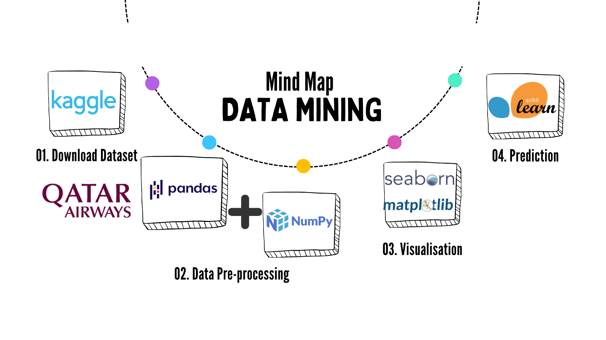

#### Check the notebook data_mining in the folder "project", you'll find the whole project in details.
Here are the tools used in my project: 

The project is divided to four parts:
1) Data Understanding
2) Data Cleaning
3) Exploratory Data Analysis
4) Prediction

<strong>Wish you Enjoooooy the code</strong>

